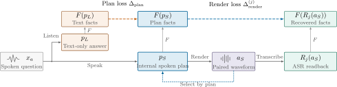
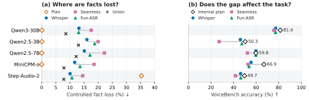
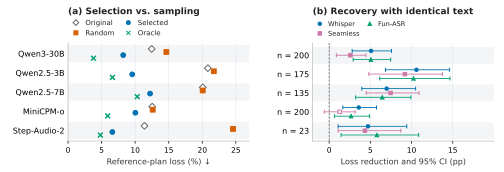
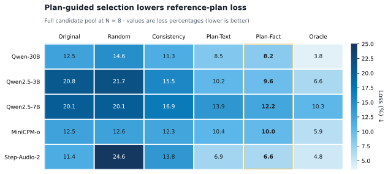
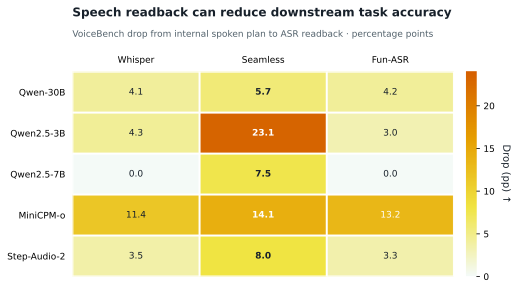
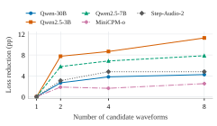

# AudioLLM-RFG

<p align="center"><strong>English</strong> · <a href="README_zh.md">简体中文</a></p>

Official implementation of **Reusing the Internal Spoken Plan: Localizing Loss and Recovering Facts in Speech Language Models**.

[Paper (coming soon)](#citation) · [Code](https://github.com/yunlong-hub/AudioLLM-rfg)

## Overview

Speech language models may preserve a fact in their internal text while losing it in the spoken waveform. AudioLLM-RFG provides a pathwise audit that compares signed atomic facts along the generation path:

```text
text or speech input
        ↓
internal spoken plan
        ↓
generated waveform
        ↓
independent ASR readbacks
```

The framework separates two failure sources:

- **Plan loss:** facts change when the model switches from a text-output path to a speech-output path.
- **Render loss:** facts present in the internal spoken plan are no longer recoverable from the generated waveform.



The figure above is the method overview used in the paper: the internal spoken plan is the shared reference for both factual localization and candidate recovery.

It also reuses the internal plan as a reference for selecting among multiple speech candidates. Selection and evaluation use disjoint ASR views, so recovery is measured without an external reference answer and without evaluating on the recognizers used for selection.

## Main features

- Pathwise localization across text-only answers, internal speech plans, waveforms, and ASR readbacks.
- Signed atomic facts covering numbers, units, named entities, short factual content, and polarity.
- Fixed-text and matched-input controls for separating answer changes from spoken realization errors.
- Three-recognizer evaluation with Whisper, SeamlessM4T, and Fun-ASR.
- Held-out-ASR candidate selection and leave-one-ASR-out evaluation.
- Candidate-budget curves for `N = 1, 2, 4, 8`.
- Bootstrap confidence intervals clustered by question.

## Evaluated checkpoints

The paper evaluates five checkpoints from three model families:

| Family | Checkpoint | Runtime used in the paper |
| --- | --- | --- |
| Qwen | Qwen3-Omni-30B-A3B-Instruct | Transformers |
| Qwen | Qwen2.5-Omni-3B | Transformers |
| Qwen | Qwen2.5-Omni-7B | vLLM-Omni |
| Step-Audio | Step-Audio-2-mini | Official Step-Audio runtime |
| MiniCPM | MiniCPM-o-4.5 | Transformers / model-provided chat interface |

The recognizer views are Whisper-large-v3, SeamlessM4T-v2-large, and Fun-ASR-Nano-2512.

## Repository layout

```text
AudioLLM-rfg/
├── configs/              # Portable decoding and environment configurations
├── docs/                 # Method and reproduction notes
├── scripts/
│   ├── data/             # Controlled-set construction and question TTS
│   ├── infer/            # Speech-language-model inference
│   ├── facts/            # ASR readback, fact extraction, and scoring
│   ├── analyze/          # Controls, robustness checks, and recovery analyses
│   └── pipelines/        # End-to-end pipeline entry points
├── src/rfg/
│   ├── data/             # Controlled-item construction
│   ├── models/           # Model and ASR adapters
│   ├── facts/            # Fact schema, extraction, and readback handling
│   ├── score/            # Path losses and candidate-selection metrics
│   └── run/              # Shared execution logic
├── tests/                # Unit and contract tests
├── tools/                # Auditing and analysis utilities
└── pyproject.toml
```

Model weights, datasets, generated audio, predictions, logs, and experiment outputs are intentionally excluded from Git.

## Installation

Python 3.10 or later is required. Create an isolated environment and install the package in editable mode:

```bash
git clone https://github.com/yunlong-hub/AudioLLM-rfg.git
cd AudioLLM-rfg

python -m venv .venv
source .venv/bin/activate
python -m pip install --upgrade pip
python -m pip install -e ".[dev]"
```

The five speech models do not all share the same inference stack. Install each upstream model according to its official instructions and license. In particular, the paper uses vLLM-Omni for Qwen2.5-Omni-7B and a separate official runtime for Step-Audio-2-mini.

No checkpoint is downloaded automatically by this repository.

## Quick start

### 1. Validate the controlled-set generator

```bash
python scripts/data/build_items.py --split pilot --verify-only
```

Generate the 200-question pilot manifest:

```bash
python scripts/data/build_items.py \
  --split pilot \
  --out data/pilot/items.jsonl
```

The pilot contains 40 questions from each of five categories: numbers, units, proper nouns, negation, and short factual content.

### 2. Generate model outputs

After preparing question audio and an upstream model checkpoint:

```bash
python scripts/infer/infer.py \
  --model /path/to/speech-language-model \
  --items data/pilot/items.jsonl \
  --run-id pilot \
  --conditions READ,LISTEN,SPEAK,ECHO,EF
```

The five controlled conditions are:

| Condition | Input | Output | Purpose |
| --- | --- | --- | --- |
| `READ` | Text | Text | Text-input baseline |
| `LISTEN` | Speech | Text | Speech-input plan baseline |
| `SPEAK` | Speech | Text + speech | Main speech-output path |
| `ECHO` | Text | Text + speech | Input-modality control |
| `EF` | Fixed text | Speech | Fixed-content rendering control |

### 3. Transcribe, extract facts, and score

The remaining stages operate on `exp/<run_id>/predictions/`:

```bash
# ASR readback
python scripts/facts/readback.py --run-id pilot

# Deterministic rule-based fact extraction
python scripts/facts/extract_facts.py --run-id pilot

# Optional rule + LLM extraction
python scripts/facts/extract_facts.py \
  --run-id pilot \
  --with-llm \
  --llm-model /path/to/Qwen2.5-7B-Instruct

# Pathwise scoring
python scripts/facts/score.py \
  --run-id pilot \
  --items data/pilot/items.jsonl
```

Use `--readback-mode asr1`, `asr2`, `asr3`, or an available union mode when recomputing recognizer-specific results. See `python <script> --help` and [`scripts/README.md`](scripts/README.md) for stage-specific options.

### 4. Evaluate candidate recovery

Candidate generation and held-out-ASR evaluation are implemented in:

- `scripts/analyze/generate_vllm_omni_resamples.py`
- `scripts/analyze/generate_stepaudio_resamples.py`
- `scripts/analyze/generate_minicpmo_resamples.py`
- `scripts/analyze/evaluate_frr_loo.py`
- `scripts/analyze/evaluate_frr_curve.py`

These scripts write their outputs under `exp/`, which is ignored by Git.

## Key results

### The audit localizes where facts are lost



Across the five evaluated checkpoints:

- Qwen3-Omni-30B, Qwen2.5-Omni-3B/7B, and MiniCPM-o retain nearly all extracted facts in their internal spoken plans (`0.0%–0.1%` plan loss), while their waveform readbacks lose `11.7%–22.2%` under individual recognizers.
- Step-Audio-2 shows the complementary, plan-dominated profile, demonstrating that the audit separates two genuinely different failure modes rather than assigning every error to speech rendering.
- VoiceBench results connect plan-to-waveform loss with downstream task accuracy: readback accuracy can fall even when the internal plan remains correct.

### The internal plan can guide recovery



At eight candidates, plan-guided fact selection reduces reference-plan loss by `2.5–11.3` percentage points across all five checkpoints. It outperforms random selection and plan-free ASR consistency selection in reference-plan fidelity. Recovery remains on identical-text candidate pools, showing that the gain is not explained only by changing the model's answer.

The identical-text confidence intervals exclude zero in 14 of 15 model/recognizer comparisons; MiniCPM-o evaluated through Seamless is the exception.

### Plan guidance is robust across selection objectives



On the full candidate pool, Plan-Fact achieves lower reference-plan loss than the original sample, random selection, and plan-free ASR consistency for every checkpoint. Plan-Text is also effective, while the oracle remains an explicitly unattainable upper bound rather than a deployable baseline.

### Rendering loss has measurable downstream impact



The accuracy-drop view isolates the downstream cost of converting an internal plan into speech. The effect varies by model and recognizer—from no measured drop in two Qwen2.5-7B views to a 23.1-point drop for Qwen2.5-3B through Seamless—supporting multi-recognizer reporting instead of relying on a single ASR view.

### Recovery generally improves with candidate budget



Increasing the candidate pool from one to eight waveforms strengthens recovery for all five checkpoints at the final budget. The curve reports held-out-ASR, leave-one-recognizer-out evaluation; the recognizer used to score a candidate is never used to select it.

All plotted values are the aggregate values reported in the paper. Raw predictions, generated audio, and per-example evaluation records are excluded from this code-only repository.

## Testing

Run the repository test suite with:

```bash
pytest -q
```

The tests cover fact normalization, signed-fact matching, readback state, model registration, benchmark scoring, candidate selection, leave-one-ASR-out evaluation, and experiment guards.

## Data and model policy

This repository is a code-only release. It does not redistribute:

- speech-language-model or ASR checkpoints;
- benchmark datasets governed by upstream licenses;
- generated waveforms or model predictions;
- per-example experiment records or internal evaluation caches.

Download each model and benchmark from its official source and comply with the corresponding terms. Local assets should remain under ignored directories such as `pretrain_model/`, `data/`, `exp/`, and `output/`.

## Citation

The paper link and archival identifier will be added after public release. For now, please cite:

```bibtex
@article{zhang2026reusing,
  title   = {Reusing the Internal Spoken Plan: Localizing Loss and Recovering Facts in Speech Language Models},
  author  = {Zhang, Yunlong and Wang, Yonghe and Bao, Feilong},
  year    = {2026},
  note    = {Preprint}
}
```

## Contact

For questions, please open a GitHub issue or contact `cszyl@mail.imu.edu.cn`.
